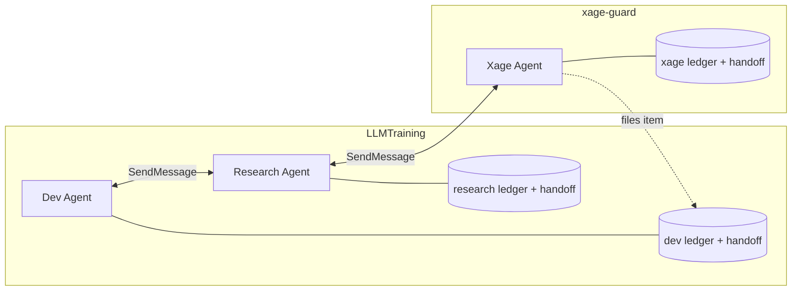

# Agents, ledger and handoff

Design workspace for the fresh slate. The previous Apex lives in `example/` as a reference only.

## Fixed opinions

- No planning step. The plan is a ledger item.
- An Agent owns exactly one ledger and one handoff, and works the ledger one item at a time, executing each item
  directly, through a subagent, or through Ultracode.
- A handoff's startup procedure points at the Agent's live notes (which replace Claude memory) and at a graphify update.
- Everything lives under `.claude/`. The protocol behaves identically whether a path is gitignored or tracked, and never
  mentions which.
- Binary-light: Go only where the answer must be deterministic.
- Ponytail and graphify are required dependencies.
- Git is governed by a git-discipline skill with per-repo conventions; push and PR happen only on the operator's word.

## What an Agent is

An Agent is a user-defined skill. The user names it at session start; nothing selects it automatically. Any number of
Agents can be active in one repo at once, and they either work independently or collaborate.

An Agent defines two things:

1. What to pre-load: other skills, either repo skills or plugin skills. The Agent is a standard-format skill whose body
   tells the model which skills to load at start; there is no custom frontmatter.
2. What it owns: one ledger and one handoff.

An Agent's skill, ledger and handoff live in its home repo. It may work in other repos, but its state never moves there.
Cross-repo work needs no special command: the Agent notes it in the ledger item it is working.

Built-in roles (build, review, research) are not Agents. They are single-use Ultracode or subagent roles that execute a
slice of some Agent's ledger item and report back; they own no state.

Example: LLMTraining runs a Dev Agent and a Research Agent at home, collaborating with a Xage Agent whose home is
`xage-guard`.



## Layout

```
<repo>/.claude/
  skills/<agent>/SKILL.md      role card, user-owned; body lists the skills to pre-load
  skills/<agent>/LIVE.md       live notes, agent-owned; replaces memory
  ledger/<agent>/NNN.md        one item per file, never deleted
  ledger/<agent>/handoff.md    one file, overwritten
  graphify/<checkout>/         one graph per checkout
  git.md                       this repo's commit, push and PR conventions
```

`SKILL.md` and `LIVE.md` are separate files so the Agent can keep notes without rewriting its own role. Claude Code
live-reloads only `SKILL.md`, so the skill reads `LIVE.md` with a file read at start rather than embedding it.

`<repo>` is always the main checkout, even when the Agent works in a worktree.

## Ledger item

The binary owns the frontmatter; the model owns the body.

```
---
id: 007
title: one line
kind: task | followup
status: open | in-progress | closed
created: 2026-09-30
closed: 2026-10-01
reason: one line
---
## Goal       From: <who asked: user, 003, repo:agent/004>; what done means, checkable
## Approach   direct | subagent | ultracode, and why
## Log        one line per step; the crash cursor
## Outcome    written at close
```

An item too big for one pass closes with `reason: split: 008-010`, and the children are added.

`open -> in-progress -> closed`; `close` also works from open; `reopen` returns either to open. At most one item per
Agent is in progress.

## Session flow

1. The user invokes `/<agent>`. The Agent reads `LIVE.md`, its pre-loads and `handoff.md`, then runs the handoff's
   Startup steps.
2. Per item: `apex start`, execute (direct, subagent or Ultracode) logging each step, review plus `/ponytail-review`,
   update `LIVE.md`, `apex close`, rewrite `handoff.md`.

Every stateful `apex` verb takes an explicit `--agent`. There is no default Agent.

## Handoff

The handoff is a markdown file the Agent writes and reads with ordinary commands; the binary has no handoff verb. Its
format and startup steps live in the Agent skill.

```
---
checkout: <absolute path of the checkout worked in>
branch: <git rev-parse --abbrev-ref HEAD>
head: <git rev-parse HEAD>
---
## Startup     invoke the Agent skill (reads LIVE.md); apex graph update .; apex list --agent <agent>
## State       current item and where it stopped, uncommitted work
## Next
## Open threads
```

The handoff is stale when the recorded checkout no longer exists, or its branch or HEAD differs. `head` is always the
full SHA and is compared in full, never abbreviated. A stale handoff is still read; staleness tells the Agent to
reconcile State against what changed.

## Collaboration

- Peers talk through `ListAgents` and `SendMessage`.
- A peer can file an item into another Agent's ledger; only the owner starts or closes it.

## Graphify discipline

The protocol does not use the `/graphify` skill, which hardcodes `graphify-out/` at the repo root. The
`graphify-discipline` skill states how Agents use the `graphify` CLI inside this protocol.

**Location.** graphify reads the `GRAPHIFY_OUT` env var once at start and accepts an absolute path. Verified on
graphify 0.9.72: with it set, `update` wrote `graph.json`, `GRAPH_REPORT.md`, `manifest.json` and `cache/` there, and
`query` found the graph through the same variable.

Agents never call `graphify` directly. `apex graph <args>` resolves the main checkout and the current checkout, sets
`GRAPHIFY_OUT` to `<main>/.claude/graphify/<checkout>/`, and runs `graphify <args>` unchanged. `<checkout>` is `main`
for the main checkout and the worktree's directory name otherwise, so Agents on different branches never overwrite
each other's graph. A wrapper rather than an instructed env prefix, because one forgotten prefix writes
`graphify-out/` into the repo root.

A worktree's graph lives exactly as long as the worktree does on disk. Every `apex graph` call compares `graphify/*/`
against `git worktree list` and deletes each graph whose worktree directory no longer exists.
`main` is never pruned.

**When.** The session's Agent runs `apex graph update .` at startup and again before the first query after code
changed. `update` re-extracts code only, with no LLM, in under a second on a mid-sized repo, so it always runs rather
than checking for staleness. The Agent and its subagents orient with `query`, `explain`, `path` and `affected`;
subagents and Ultracode workers only read. Concurrent writers are safe because graphify
replaces files atomically and the rebuild is deterministic; the last writer wins.

**Reading.** Every read passes `--budget`. A truncated answer means narrowing the question, not raising the budget
blindly.

**Never.** `hook install`, `claude install`, `watch`, `save-result`/`reflect` (graph memory overlaps `LIVE.md`), and
`extract` (LLM semantic extraction) outside a ledger item created for it.

## Git discipline

The `git-discipline` skill keeps the message rules of the current `atomic-git-discipline`: Conventional Commits, terse
subject, body only for a non-obvious why, no AI attribution. It changes two things.

1. **Per-repo conventions.** Each repo states its own commit, push and PR conventions in `.claude/git.md`: message
   format, branch naming, ticket prefixes, remotes, PR template. The skill reads that file first and falls back to its
   defaults for anything unstated. The `apex-init` skill writes it.
2. **Permission defaults.**

| Action | Default |
|---|---|
| Commit | on the operator's approval, or automatically when `.claude/git.md` says so |
| Push | on the operator's approval only |
| PR | only when the operator asks for one |

The Agent never reminds the operator to open a PR, and says nothing about pushing until the operator gives Sign off.

## Session start and Sign off

The `apex-init` skill adds a short section to the repo's `CLAUDE.md` that frames every session.

- **Start:** invoke your Agent skill.
- **Sign off:** a notice the operator gives to end a session, handled by the `sign-off` skill. The skill runs from
  `/sign-off` or when the operator says "sign off". The Agent then:
  1. logs where the in-progress item stopped, or closes it;
  2. updates `LIVE.md`;
  3. writes the handoff;
  4. cleans up what the session started: scratch files, servers, merged worktrees;
  5. reports unpushed commits. This is the only point where pushing comes up.

## Auto-memory

Auto-memory is off, and `LIVE.md` replaces it. When `settings.json` is committed, that setting applies to everyone who
works in the repo; the protocol accepts this.

## Init and migrate

A repo adopts the protocol in a single-use session that runs the `apex-init` skill. The skill inspects the repo and
routes to exactly one outcome:

| State found | Outcome |
|---|---|
| No agents, no ledgers | initialize from a blank slate |
| Agent skills, ledgers or handoffs in a foreign layout | migrate |
| Already follows the rules | report conformant, change nothing |

The binary has no init or migrate verb. The skill moves files and rewrites them, and files ledger items through
`apex add`.

LLMTraining is the first migration target. Its foreign layout: `DevLedger/` and `ResearchLedger/` at the repo root with
a hand-kept `INDEX.md`, handoffs in `docs/handoff/`, role cards in `.claude/skills/`, and project facts in memory.

## Open questions

1. `apex-init` detection: which signals prove a repo conformant. Evolving by design: implement first, dry-run on
   LLMTraining, then calibrate.
